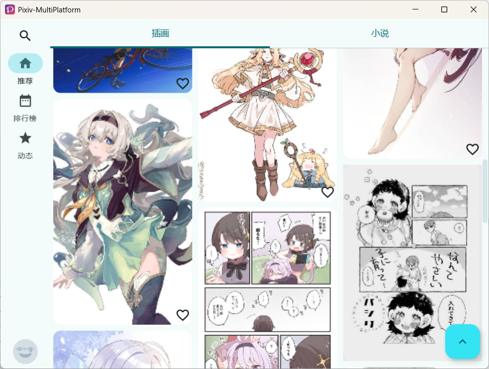
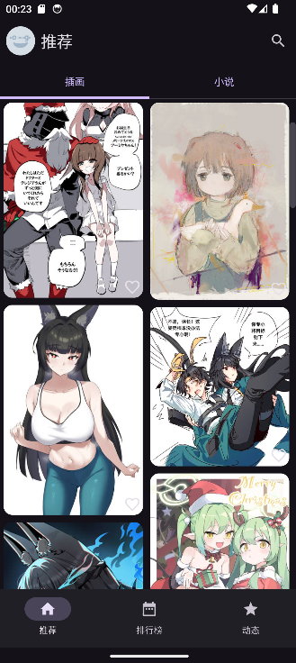
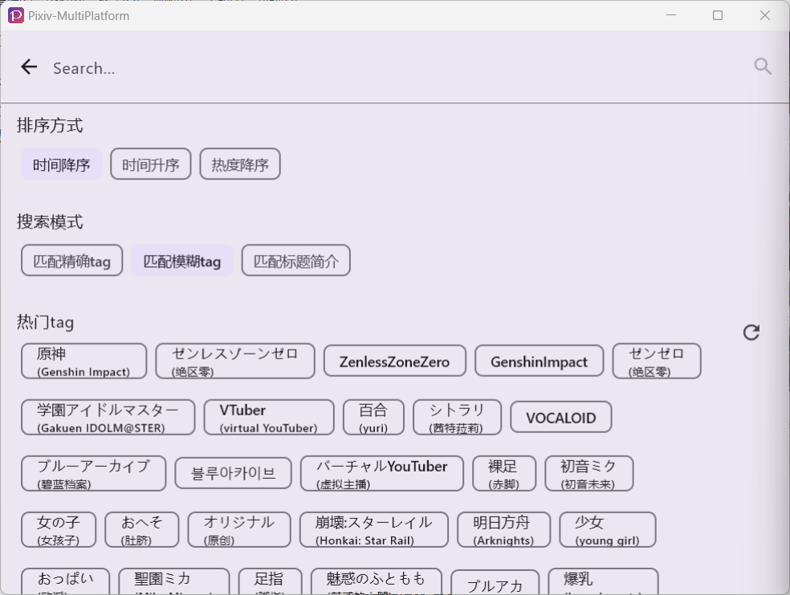
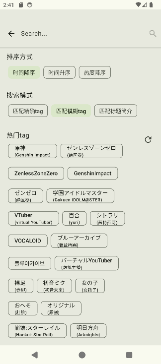
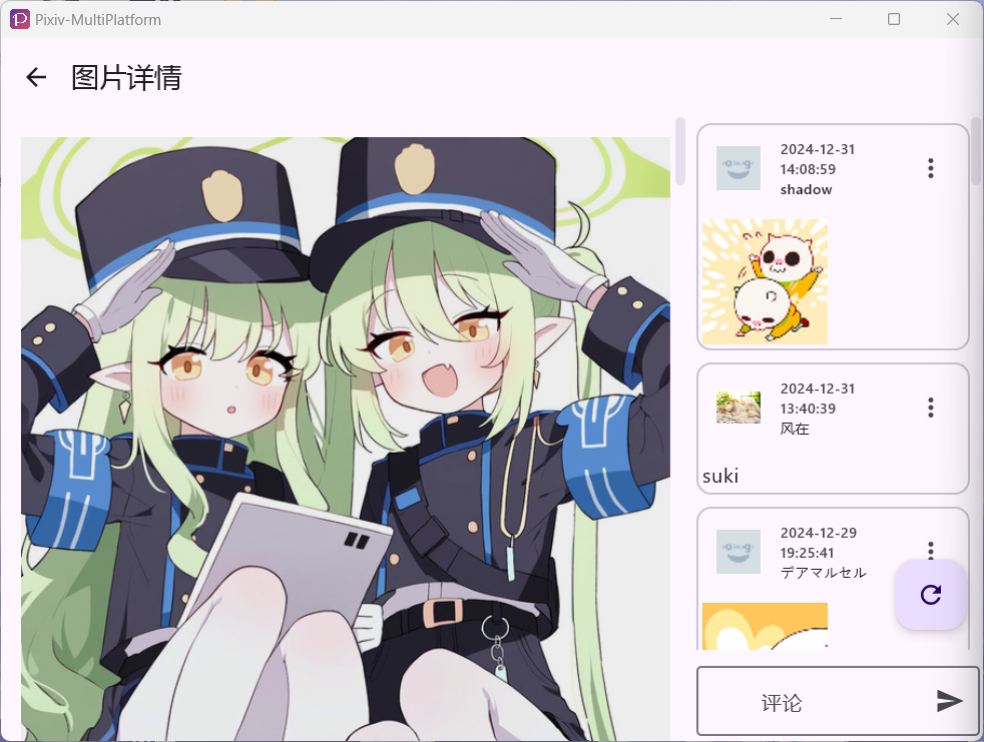
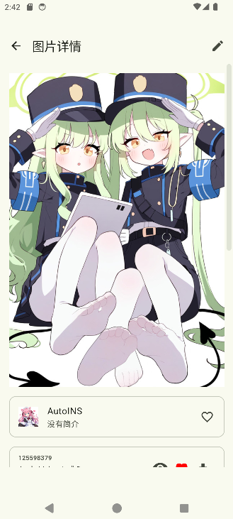
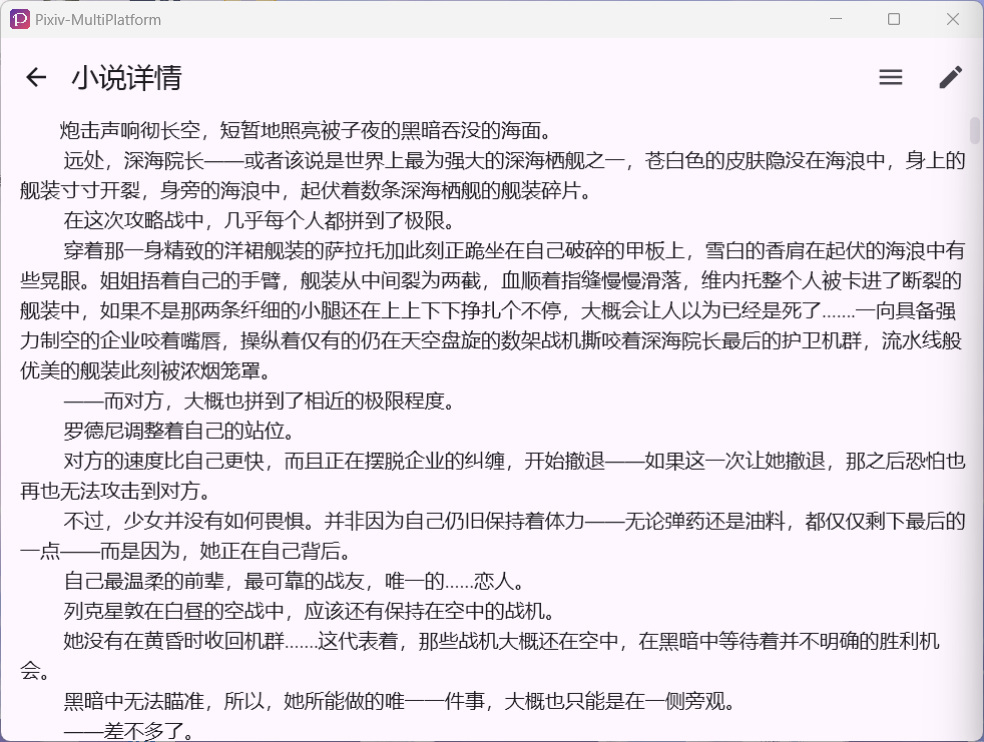
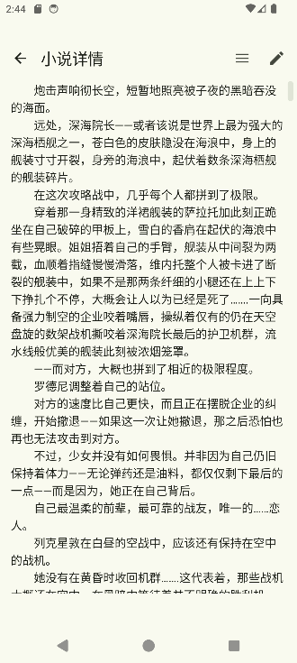

> 中文说明在 [这里](./README.md)

---

    
    <h1>Pixiv-MultiPlatform</h1>
    
A cross-platform third-party Pixiv client based on Kotlin technology stack

    <table>
        <thead align="center">
            <tr>
                <th>License</th>
                <th>Downloads</th>
                <th>Issues</th>
                <th>Last Commit</th>
            </tr>
        </thead>
        <tbody align="center">
            <tr>
                <td>
                    
                </td>
                <td>
                    
                </td>
                <td>
                    
                    
                </td>
                <th>
                    
                </th>
            </tr>
        </tbody>
    </table>
    

> Before the new version is released, please go to workflow to download the iOS ipa file.

## 1. Download Links

**Click here to download -->**   

## 2. Features Screenshots (Wide and narrow screen colors differ due to different themes)

| Feature | Windows Linux macOS UI | Android, iOS UI |
|-------|-------------------------------------------------------------------------|-------------------------------------------------------------------------|
| Illustration Feed |  |  |
| Search Bar |  |  |
| Image Details |  |  |
| Novel Reading |  |  |

## 3. Feature List

> Features marked with a check are implemented, those unmarked will be implemented in future versions
>
> Issues are welcome to provide good ideas. Good ideas will be added to the **TODO** table below for future implementation.

- [x] Login via built-in browser
- [x] Home Page
  - [x] Recommendations
    - [x] View recommended illustrations
    - [x] View recommended novels
  - [x] Illustration Rankings
    - [x] Daily ranking
    - [x] Weekly ranking
    - [x] Monthly ranking
    - [x] Male-oriented 
    - [x] Female-oriented
    - [x] Original
    - [x] Rookie
  - [x] Activity Feed
    - [x] View latest illustrations from followed users
    - [x] View latest illustrations site-wide
- [x] Search
  - [x] Popular tags
  - [x] Search suggestions
  - [x] Title match mode
  - [x] Sort methods (popularity, newest first, oldest first)
  - [x] Search results
    - [x] Illustrations
    - [x] Novels
    - [ ] Novel series
    - [x] Artists
  - [x] Search results by ID (illustration/novel/artist)
- [ ] Illustration Details
  - [x] Basic preview
  - [ ] Original image display
  - [x] Download original image
  - [x] Bookmark illustrations
    - [x] Bookmark by TAG category
    - [x] Set as private bookmark
  - [x] Like
  - [x] View comments
  - [x] View replies
  - [x] Reply to illustrations
  - [x] Reply to comments
- [x] Novel Details
  - [x] Basic reader
    - [x] Page navigation
    - [x] Link support
    - [x] Inline images
  - [x] Export novel to epub format
  - [x] Bookmark novels
    - [x] Bookmark by TAG category
    - [x] Set as private bookmark
  - [x] View novel series
  - [x] Comments
    - [x] View comments
    - [x] View replies
    - [x] Reply to novels
    - [x] Reply to comments
- [ ] User Center
  - [x] View profile
  - [ ] Edit profile
  - [x] View bookmarks
    - [x] View public bookmarks
    - [x] View private bookmarks
    - [x] Filter bookmarks by TAG
  - [ ] View follows
  - [x] History
  - [x] Download management
  - [x] Logout
- [x] Other features
  
  - [x] PC keyboard shortcuts (since V1.6.0)
  
    | Shortcut | Function |
    | ------ | ---------------------------------------------- |
    | ↑ | Scroll up |
    | ↓ | Scroll down |
    | PgDn | Scroll down one page |
    | R | Refresh page when at the top, otherwise return to the top |
    | ← | Switch to left tab (e.g., on recommendation page) |
    | → | Switch to right tab (e.g., on recommendation page) |
  - [x] Invalid illustration/novel filtering (deleted illustrations, no permission illustrations)
  - [x] Manual illustration/novel filtering (R18, R18G, AI)
  - [x] Block novels with excessive tags
  - [x] Block novels with very short content
  - [x] Direct connection using DoH
  - [ ] Custom TAG filtering
  - [ ] Internationalization
